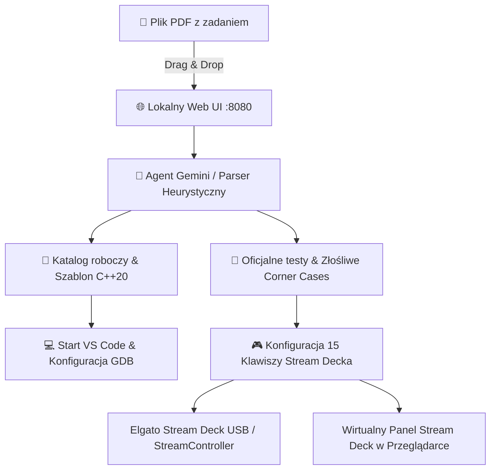

# AlgoDeck ⚡
### Zautomatyzowane środowisko do algorytmiki (Szkopuł / MAP / OI) ze wsparciem Stream Decka

> **Cel:** Maksymalne skrócenie czasu od pobrania zadania do rozpoczęcia pisania kodu. Zero ręcznego tworzenia plików, kopiowania testów czy ręcznego konfigurowania skrótów.

---

## 🚀 Główny Workflow (User Experience)

1. **Lokalny interfejs webowy (`http://localhost:8080`)**:
   - Metodą drag-and-drop wrzucasz plik PDF z treścią zadania (np. ze Szkopuła, MAP czy Olimpiady Informatycznej).
2. **Praca Agenta AI w tle**:
   - **Analiza treści:** Ekstrakcja limitu czasu, limitu pamięci, formatu wejścia/wyjścia oraz krótkiego identyfikatora zadania (np. `kol` dla *Koleje*).
   - **Tworzenie katalogu i kodu:** Generowanie dedykowanego katalogu roboczego (`~/algodeck-workspace/<zadanie>/`) z kompletnym olimpijskim szablonem C++20 (szybkie I/O, makra debugujące, typy `ll`, `pii`, `vi`).
   - **Ekstrakcja i generowanie testów:** Pobranie oficjalnych przykładów z treści oraz automatyczne wygenerowanie **złośliwych testów brzegowych (corner cases)**:
     - Minimalne dane wejściowe ($N=1$, puste sekwencje, zera).
     - Wartości skrajne i pułapki na 32-bitowy integer overflow (wymóg `long long`).
     - Przypadki zdegenerowane (np. grafy niespójne, gwiazdy, cykle).
   - **Automatyczny start edytora:** Błyskawiczne uruchomienie Visual Studio Code z otwartym plikiem źródłowym i skonfigurowanymi zadaniami kompilacji oraz debugera GDB.
3. **Dynamiczna integracja ze Stream Deckiem (15 przycisków)**:
   - Automatyczne wygenerowanie dedykowanego panelu / strony w oprogramowaniu **StreamController** oraz wbudowanym bezpośrednim sterowniku sprzętowym USB.
   - Odpalanie pojedynczych testów, zbiorczego testu, AddressSanitizera, kopiowanie wejść do schowka (`wl-copy`), pomiar czasu i natychmiastowe ubicie procesu (Kill).
   - Jeśli nie masz podłączonego fizycznego urządzenia, na stronie działa **wirtualny Stream Deck 3×5** z identycznym zachowaniem i podświetleniem LCD!



---

## 🎮 Układ 15 Przycisków Stream Decka (3 wiersze × 5 kolumn)

Dla każdego załadowanego zadania przyciski są konfigurowane automatycznie:

| Wiersz | Klawisz 1 | Klawisz 2 | Klawisz 3 | Klawisz 4 | Klawisz 5 |
| :--- | :--- | :--- | :--- | :--- | :--- |
| **Wiersz 1**<br>*(Kompilacja i Zarządzanie)* | 🔨 **BUILD**<br>`g++ -O3` | 🐞 **DEBUG**<br>`AddressSanitizer` | 🚀 **ALL TESTS**<br>Zbiorcze uruchomienie | ⏱️ **BENCH**<br>Pomiar czasu (ms) | 🛑 **KILL**<br>Natychmiastowy SIGKILL |
| **Wiersz 2**<br>*(Oficjalne Testy i Schowek)* | 🧪 **TEST 1**<br>Przykład 1 + diff | 🧪 **TEST 2**<br>Przykład 2 + diff | 🧪 **TEST 3**<br>Przykład 3 + diff | 📋 **COPY 1**<br>Kopiuj wejście 1 (`wl-copy`) | 📋 **COPY 2**<br>Kopiuj wejście 2 |
| **Wiersz 3**<br>*(Corner Cases i Nawigacja)* | ⚠️ **EDGE 1**<br>Corner case $N=1$ | ⚠️ **EDGE 2**<br>Corner case Overflow | ⚔️ **STRESS**<br>Test z brute force | 💻 **VSCODE**<br>Otwórz projekt | 🔄 **ZADANIE**<br>Przełącz następne zadanie |

### Informacja zwrotna na wyświetlaczach LCD przycisków:
- 🟢 **Szmaragdowy / Zielony:** Test zaliczony (`OK 12ms`), brak wycieków pamięci.
- 🔴 **Karmazynowy / Czerwony:** Błąd odpowiedzi (`WA`), błąd kompilacji (`CE`) lub błąd wykonania (`RTE / Segfault`).
- 🟠 **Pomarańczowy:** Przekroczenie limitu czasu (`TLE >1.0s`).
- 🟡 **Pulsowanie bursztynowe:** Trwa wykonywanie testu (`RUN...`).
- 🔵 **Niebieski:** Skopiowano wejście do schowka systemowego (`COPIED!`).

---

## 💻 Instalacja One-Click (Bootstrap dla Fedora KDE Plasma)

Repozytorium zawiera w pełni zautomatyzowany skrypt instalacyjny `bootstrap.sh`, który przygotowuje całą stację roboczą od zera:

```bash
# Sklonuj repozytorium i uruchom instalator:
git clone https://github.com/veritus-git/AlgoDeck.git
cd AlgoDeck
chmod +x bootstrap.sh
./bootstrap.sh
```

Lub jedno polecenie bezpośrednio z terminala:
```bash
curl -fsSL https://raw.githubusercontent.com/veritus-git/AlgoDeck/main/bootstrap.sh | bash
```

### Co automatycznie wykonuje skrypt bootstrap:
1. **Narzędzia C++:**
   - Instaluje `gcc`, `gcc-c++`, `gdb`, `clang`, `make`, `cmake`, `ninja-build`, `valgrind`, `glibc-devel`, `libstdc++-devel`.
2. **Narzędzia Wayland & KDE Plasma:**
   - Instaluje `wl-clipboard` (natywny schowek dla sesji Wayland w KDE Plasma) oraz `xclip`.
3. **Reguły udev dla Elgato Stream Deck:**
   - Konfiguruje `/etc/udev/rules.d/60-streamdeck.rules` z prawami dostępu do urządzeń USB bez konieczności roota (`TAG+="uaccess"`, `MODE="0666"`).
   - Automatycznie przeładowuje podsystem udev (`udevadm control --reload-rules && udevadm trigger`).
4. **Visual Studio Code:**
   - Dodaje oficjalne repozytorium Microsoft RPM (`/etc/yum.repos.d/vscode.repo`) i klucz GPG.
   - Instaluje pakiet `code` oraz oficjalne rozszerzenia: `ms-vscode.cpptools` i `ms-vscode.cpptools-extension-pack`.
5. **StreamController (Flatpak):**
   - Dodaje repozytorium Flathub i instaluje `com.core447.StreamController` – natywne linuksowe oprogramowanie do zarządzania Stream Deckiem.
6. **Backend AlgoDeck:**
   - Tworzy dedykowany wirtualny folder Pythona w `~/.local/share/algodeck/venv`.
   - Instaluje zależności: `FastAPI`, `Uvicorn`, `google-genai`, `streamdeck`, `pypdf`, `Pillow`, `websockets`, `psutil`.
7. **Integracja z systemem:**
   - Tworzy polecenie `algodeck` w `~/.local/bin/algodeck`.
   - Tworzy aktywator na pulpicie i w menu programów KDE Plasma (`~/.local/share/applications/algodeck.desktop`).
   - Konfiguruje opcjonalną usługę użytkownika systemd (`systemctl --user start algodeck`).

---

## 🧠 Konfiguracja Agenta Gemini (Konto / CLI / API)

AlgoDeck wspiera elastyczne metody uwierzytelniania w Google Gemini:

1. **Standardowe logowanie przez konto (Gemini CLI / gcloud ADC):**
   - Jeśli korzystasz z konta Google zalogowanego w CLI (`gcloud auth application-default login`), pakiet `google-genai` automatycznie wykorzystuje Twoje standardowe limity konta.
2. **Klucz Gemini API (`GEMINI_API_KEY`):**
   ```bash
   export GEMINI_API_KEY="twój-klucz-api"
   ```
   Możesz także wpisać klucz bezpośrednio w oknie ustawień (ikona ⚙️) w przeglądarce.
3. **Wbudowany parser heurystyczny (100% Offline):**
   - W przypadku braku połączenia internetowego lub braku klucza API, AlgoDeck automatycznie uruchamia wbudowany algorytm ekstrakcji treści i tabel ze Szkopuła. Nigdy nie zostaniesz zablokowany podczas zawodów!

---

## 📁 Struktura Wygenerowanego Katalogu Zadania

Po upuszczeniu pliku PDF (np. `koleje.pdf`), w `~/algodeck-workspace/kol/` pojawia się:

```
~/algodeck-workspace/kol/
├── kol.cpp                     # Główny plik rozwiązania z szablonem olimpijskim
├── brute.cpp                   # Szablon wzorca naiwnego (do stress-testingu)
├── gen.py                      # Generator losowych testów (do stress-testingu)
├── Makefile                    # make (O3), make debug (ASan), make clean
├── statement.pdf               # Kopia oryginalnej treści zadania
├── problem.json                # Metadane, limity i rejestr testów
├── tests/
│   ├── test_1.in / test_1.out  # Oficjalne testy z treści
│   ├── test_2.in / test_2.out
│   ├── edge_1.in / edge_1.out  # Złośliwy test: N=1 / min
│   └── edge_2.in / edge_2.out  # Złośliwy test: Overflow / max bounds
├── streamdeck_scripts/         # Skrypty akcji podpinane pod przyciski
│   ├── 0_build_fast.sh
│   ├── 1_build_debug.sh
│   ├── 2_run_all.sh
│   └── ...
├── kol_streamcontroller.json   # Wygenerowany profil dla StreamControllera
└── .vscode/
    ├── tasks.json              # Zadania kompilacji O3 oraz ASan w VS Code
    └── launch.json             # Gotowy profil debugera GDB (F5 w VS Code)
```

---

## 🛠️ Uruchomienie lokalne (Tryb Deweloperski)

Jeśli chcesz uruchomić serwer ręcznie:

```bash
# 1. Wejdź do katalogu projektu
cd algodeck

# 2. Aktywuj środowisko i wystartuj serwer
./scripts/dev.sh
```

Serwer uruchomi się pod adresem: **`http://127.0.0.1:8080`**  
Dokumentacja interaktywna Swagger API dostępna pod: **`http://127.0.0.1:8080/docs`**

---

## 🧪 Weryfikacja Działania (Test Jednostkowy)

Możesz w każdej chwili przetestować cały potok (od ekstrakcji PDF po kompilację i diff):

```bash
./scripts/test_pipeline.py
```

Skrypt przeprowadza automatyczny test na przykładowym zadaniu olimpijskim *Koleje (IX OI)*.
